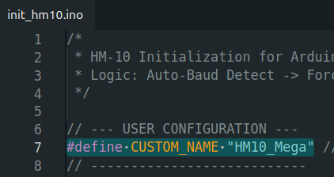
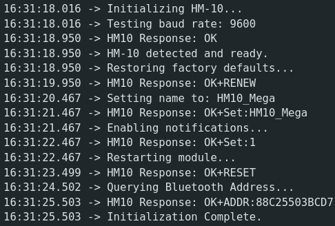
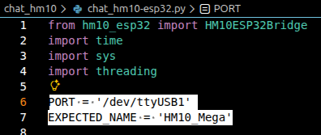
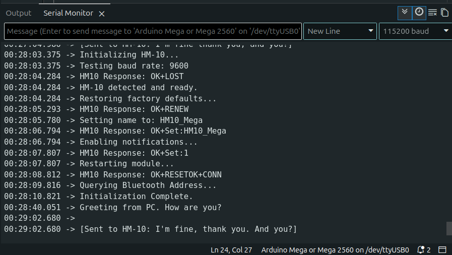
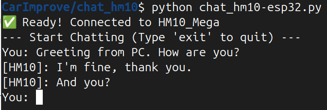

# Beginner Guide

> **Note:** This guide assumes you already have an ESP32 development kit with the esp32-hm10 firmware flashed.

## Goals

This guide will help you:
1. Initialize your own customized HM-10 Bluetooth module
2. Successfully chat with HM-10 on Arduino Mega through ESP32 using Python

## Step 1: Setting Up the HM-10 Bluetooth Module

### Wiring

Connect the HM-10 Bluetooth module to your Arduino Mega as follows:

| HM-10 Pin | Arduino Mega Pin |
|-----------|------------------|
| VCC       | 3.3V             |
| GND       | GND              |
| TX        | RX3 (Pin 15)     |
| RX        | TX3 (Pin 14)     |

### Configure the HM-10 Device Name & Initialize the HM-10 module

Follow these steps to customize your HM-10 module:

1. Open [init_hm10/init_hm10.ino](init_hm10/init_hm10.ino) using Arduino IDE

2. Edit the `CUSTOM_NAME` macro definition in [init_hm10/init_hm10.ino](init_hm10/init_hm10.ino) to your desired HM-10 device name
   
   

3. Connect your Arduino Mega to your PC using a USB cable and upload the code

4. Open the Serial Monitor to check the printed result
   
   

## Step 2: Chatting with HM-10 on Arduino Mega through ESP32 using Python
### Install Python Dependencies

Open your terminal:
- **Windows**: PowerShell
- **Linux**: sh or bash
- **macOS**: zsh

Run the following command to install the required Python package:

```bash
pip install pyserial
```

### Connecting to ESP32 and Chatting with HM-10
1. Connect your ESP32 to your PC via USB cable.
2. Identify the serial port assigned to your ESP32:
   - **Windows**: Check Device Manager under "Ports (COM & LPT)" or "序列埠" Chinese for something like `COM3`. 
   - **Linux**: Use `ls /dev/ttyUSB*` command to find something like `/dev/ttyUSB0`. 
   - **macOS**: Use `ls /dev/tty.usbserial*` to find something like `/dev/tty.usbserial-0001`. 
   
   If you cannot find the port, your system may miss the CH340 USB driver. Please refer to [CH340 Driver Installation Guide](https://docs.google.com/presentation/u/0/d/1AppyLZE2i848UmYqMS-MMrL8-V6ORkutv9SstkJ2Zmo) to install the driver.
3. Edit PORT and EXPECTED_NAME variables in [chat_hm10/chat_hm10-esp32.py](chat_hm10/chat_hm10-esp32.py) to match your ESP32's serial port and the HM-10 device name you set in Step 1.
    
4. Open terminal in chat_hm10 directory and run the Python script:

    ```bash
    python chat_hm10-esp32.py
    ```
    The python script would connect to the ESP32 and set the target HM-10 device name on ESP32 to EXPECTED_NAME. 
5. Chat with HM-10 on Arduino Mega by typing messages in the terminal. The messages will be sent to ESP32 via serial communication, and then forwarded to HM-10 via BLE. You should see the received messages printed in the Serial Monitor of Arduino IDE. Additionally, you can also type messages in the Serial Monitor to send messages back to the Python script.
     